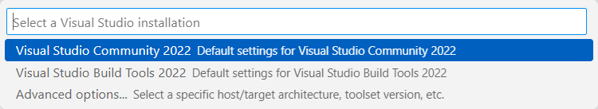

# Developer Command Prompt for VS Code

Configure your terminal to work like a Visual Studio Developer Command Prompt.

## Features

Select the default developer environment from one of your Visual Studio installations, or pick a specific toolset and architecture.

## Extension Settings

This extension contributes the following settings:

* `devcmd.persistEnvironment`: Specify whether to persist the environment for all VS Code sessions or not (on by default)

